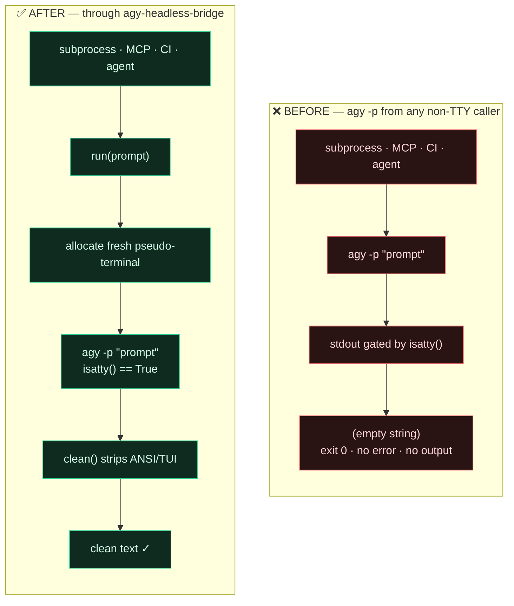
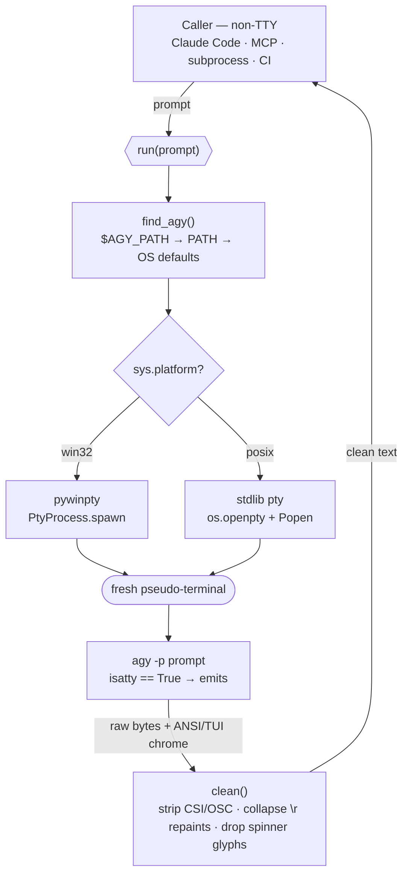

<div align="center">

# agy-headless-bridge

### Call the Google **Antigravity CLI** (`agy`) headlessly — and actually get output back.

Codename **PtyGravity** · pty + antiGravity

[](https://github.com/rhishi99/agy-headless-bridge/actions/workflows/test.yml)
[](LICENSE)
[](https://www.python.org)
[]()

📖 **[Architecture & docs → rhishi99.github.io/agy-headless-bridge](https://rhishi99.github.io/agy-headless-bridge/)**

</div>

---

## TL;DR — the problem, before & after

`agy -p "<prompt>"` prints **nothing** when its stdout is not a real terminal.
So calling it from a subprocess, an MCP server, CI, or another coding agent
(Claude Code, Codex, …) returns an empty string and exit `0` — silently. This
package gives `agy` a fresh pseudo-terminal so it emits normally, then cleans
the output.



```python
from agy_headless_bridge import run
print(run("Explain a closure in one line."))
# -> A closure is a function that remembers variables from the scope where it was defined.
```

Three entry points around one core:

| Entry point | Invoke | Use for |
|---|---|---|
| **Library** | `from agy_headless_bridge import run` | embedding agy in Python |
| **CLI** | `agy-bridge "prompt"` | shell scripts, quick calls |
| **MCP server** | `python -m agy_headless_bridge.mcp_server` | letting an agent call agy as a tool |

---

## The problem in detail — upstream bug [#76]

`agy` gates its stdout on `isatty()`. The instant stdout isn't a terminal, it
goes silent — no output, no error, exit `0`:

```console
$ agy -p "say hi" | cat
$            # empty. exit 0. nothing.
```

The common `winpty agy -p "..."` workaround needs a terminal that **already
exists**, so it still fails from any automated / non-TTY caller.

## The fix — give agy a tty it didn't ask for

Allocate a **brand-new** pseudo-terminal (one that needs no parent tty) and
attach `agy` to it. Same code path on every OS — only the pty allocator differs.



| Platform | pty backend | Status |
|---|---|---|
| **Windows** | ConPTY via [`pywinpty`] (`PtyProcess`) | ✅ verified (agy 1.0.6) |
| **Linux / macOS** | stdlib [`pty`] (`os.openpty` + `subprocess.Popen`) | 🧪 implemented, **untested** — reports welcome |

> **Why not just the existing `agy` Claude Code plugins?** They wrap `agy` for
> *triggering* (slash commands, model selection) but still call `agy -p`
> directly — so in any headless context they hit this exact empty-output bug.
> This package fixes the I/O layer they're missing. **Use both together.**

---

## Prerequisites

Before installing this bridge you need:

1. **Python 3.9+** — `python --version`.
2. **The Antigravity CLI (`agy`)**, installed and **authenticated**:
   - Install: <https://antigravity.google/cli>
   - Authenticate once interactively (`agy` opens a browser OAuth flow), or set
     `ANTIGRAVITY_API_KEY` in your environment if you use an API key.
   - Verify it runs *in a real terminal*: `agy -p "say hi"` should print a reply.
     (From a pipe it won't — that's the very bug this package fixes.)
3. **Windows only:** `pywinpty` (installed automatically as a dependency).
   POSIX uses the stdlib `pty` module — nothing extra.

> This package does **not** install or authenticate `agy`, and does not bundle
> any credentials. It only spawns the `agy` already on your machine.

---

## Install

```bash
pip install agy-headless-bridge          # pywinpty auto-installs on Windows only
```

From source:

```bash
git clone https://github.com/rhishi99/agy-headless-bridge
cd agy-headless-bridge
pip install -e .
```

The bridge locates the binary via, in order: `$AGY_PATH` → `agy` on `PATH` →
OS default install paths.

---

## Usage

### Library

```python
from agy_headless_bridge import run, AgyNotFoundError

try:
    print(run("reply with exactly: OK", timeout=60))
except AgyNotFoundError:
    print("install agy first")
```

`run(prompt, timeout=180, agy_path=None) -> str` — raises `AgyNotFoundError` if
the binary is missing, `TimeoutError` on timeout, `ValueError` on empty prompt.
Returns `""` only if agy genuinely emitted nothing.

### CLI

```bash
agy-bridge "reply with exactly: OK"
python -m agy_headless_bridge "reply with exactly: OK"   # equivalent
```

### MCP server

```bash
claude mcp add --transport stdio antigravity -- \
    python -m agy_headless_bridge.mcp_server
```

Exposes **`agy_ask(prompt)`** and **`agy_research(query)`**. The server speaks
JSON-RPC stdio directly (no MCP SDK dependency) and routes every call through
the pty bridge.

---

## Use cases & wiring it into your AI coding tools

The whole point: let **one** AI coding tool delegate work to **Gemini via
Antigravity**, headlessly. Common setups:

| Use case | How |
|---|---|
| Claude Code asks Gemini for a second opinion / diff review | MCP server → `agy_ask` tool |
| A CI step runs an `agy` prompt and captures the answer | `agy-bridge "..."` in the workflow |
| A Python pipeline fans work out to agy | `from agy_headless_bridge import run` |
| Codex / any MCP-capable agent delegates to agy | register the same MCP server |
| Cron / scheduled job summarizes logs via agy | `agy-bridge` in the script |

### Wire into Claude Code

Register the MCP server, then prompt Claude to use it:

```bash
claude mcp add --transport stdio antigravity -- \
    python -m agy_headless_bridge.mcp_server
```

> **Prompt to Claude Code:**
> *"Use the `agy_ask` tool to ask Antigravity to review this function for edge
> cases, then summarize its findings for me."*

If you also want slash-command triggering and model selection, pair this bridge
with the community `antigravity-cc` Claude Code plugin — that handles the
`/agy:*` commands and Gemini/Claude model swap; this handles the headless I/O.

### Wire into Codex (or any MCP client)

Add the server to the client's MCP config:

```json
{
  "mcpServers": {
    "antigravity": {
      "command": "python",
      "args": ["-m", "agy_headless_bridge.mcp_server"]
    }
  }
}
```

> **Prompt to the agent:**
> *"Call `agy_research` with the query 'idiomatic error handling in Rust' and
> turn the result into a checklist."*

### Use from a shell / CI script

```bash
ANSWER="$(agy-bridge 'Summarize the key risk in this diff in one sentence.')"
echo "$ANSWER"
```

---

## Configuration

| Env var | Default | Meaning |
|---|---|---|
| `AGY_PATH` | auto-detect | Absolute path to the `agy` binary |
| `AGY_BRIDGE_TIMEOUT` | `180` | Seconds before a call is killed |

---

## How `clean()` works

`agy`'s pty output is a TUI stream, not plain text. `clean()` removes **ANSI
escapes** (CSI/OSC — colors, cursor moves), **`\r` repaints** (a spinner
overwrites one line; only the final paint is kept), and **box-drawing / spinner
glyphs** (`╭─╮ │ ⠋⠙⠹`) — leaving just the model's answer.

---

## Development & CI

```bash
pip install -e ".[dev]"
pytest
```

Unit tests (cleaning, arg validation, binary discovery) always run. The live
`agy` round-trip test **auto-skips** when `agy` isn't installed — so CI runners
(which don't have `agy`) stay green and never need credentials. CI runs on
Windows + Linux across Python 3.9 and 3.12.

---

## Scope, non-goals & disclaimer

- **Model selection** (Gemini Pro / Flash / Claude inside agy) is *not* handled
  here — it's an `agy` `settings.json` concern, covered by the `antigravity-cc`
  plugin. Pair the two.
- Does **not** install or authenticate `agy`, and ships **no credentials**.
- Automating any vendor CLI may interact with that vendor's terms / rate limits.
  You are responsible for using `agy` within Google's terms of service. This
  project only changes *how stdout is captured* — it does not bypass auth,
  quotas, or any access control.
- Not affiliated with Google. *Antigravity* and *agy* are Google products.

## License

[MIT](LICENSE).

[#76]: https://antigravity.google/cli
[`pywinpty`]: https://github.com/andfoy/pywinpty
[`pty`]: https://docs.python.org/3/library/pty.html
